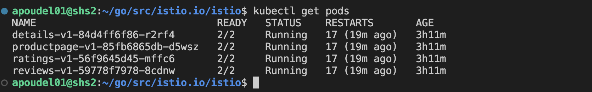
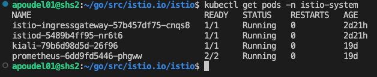
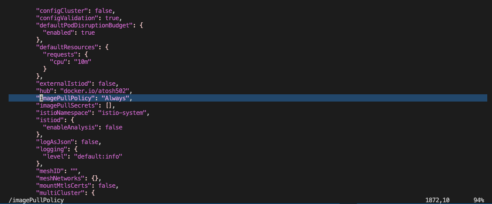
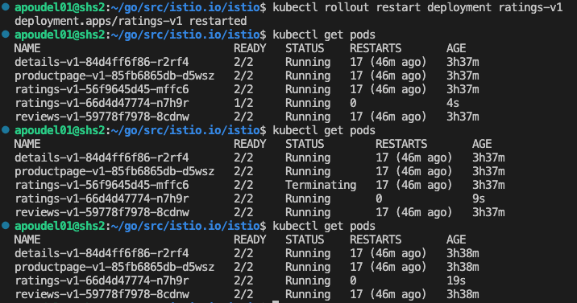
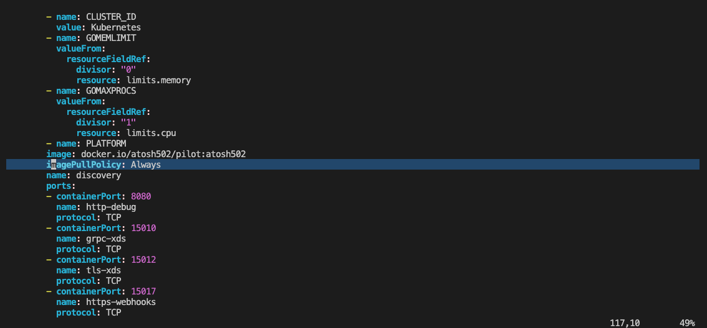

### Commands

- check if sidecar injection is enabled
    - `kubectl get namespace -L istio-injection`
    - enable sidecar injection with: `kubectl label namespace default istio-injection=enabled`

- set `imagePullPolicy` to `Always` for `istiod` (this ensures latest image for istiod is pulled from docker hub)
    - `kubectl edit deployment istiod -n istio-system`
    - set `imagePullPolicy: Always`
- update policy of sidecar to always pull new image 
	- `kubectl edit configmap istio-sidecar-injector -n istio-system`
	- set the `imagePullPolicy: Always`

- get logs from proxy (proxy resides with app container in a pod)
	- `kubectl logs <pod-name> -c istio-proxy > detailsv1-proxy.log`
- describe a kubernetes pod (useful for viewing configs and init containers within the pod) 
	- `kubectl describe pod <pod-name> > details-describe`
- get containers within a pod
	- `kubectl get pods <pod-name> -o jsonpath='{.spec.containers[*].name}'`
- update container image inside a deployment
	- `kubectl set image deployment/details-v1 istio-proxy=atosh502/proxyv2:atosh502`
- get logs from proxy (using the deployment selector instead of pod name)
	- `kubectl logs $(kubectl get pods --selector=app=details -o jsonpath='{.items[0].metadata.name}') -c istio-proxy > detailsv1-proxy.log`
- delete a pod (this will first delete then restart the pod)
	- `kubectl delete pods -l app=details`
- port forward from within kubernetes
	- `kubectl port-forward --address localhost deployment/details-v1 40000:40000`
- get a shell inside a pod's container:
	- `kubectl exec -it details-v1-79dfbd6fff-jsgz8 -c istio-proxy -- /bin/bash`
- scale number of replicas
	- `kubectl scale deployment/my-nginx --replicas=1`
- set `debug` logging for a pod using annotation (set this inside `spec:template:metadata:annotations`)
	- `sidecar.istio.io/logLevel: "debug"`
- rollout a kubernetes deployment
	- `kubectl rollout restart deployment ratings-v1`


## Making code changes

- First verify the `bookinfo` application and `istiod` are running correctly

- Use: `kubectl get pods` to get the pods running in the `default` namespace. Services within the `bookinfo` application will be in this namespace


- Use: `kubectl get pods -n istio-system` to get the pods in the `istio-system` namespace. `istiod` and other control plane components will be in this namespace.


- The development workflow for `istio` looks something like this:
	- Make changes to the code
	- Build the code using: `make DEBUG=1 docker.<component-name>`
	- Push the code to docker hub: `make push.docker.<component-name>`
	- Update the deployment of services to use the new image 

- Example: Development workflow for `proxyv2` (proxy includes `pilot-agent` (sometimes also called `istio-agent` or `node-agent`) and `envoy`)
	- Relevant code for `pilot-agent` starts at: `pilot/cmd/pilot-agent`
	- After making changes to the code, build and push `proxyv2` using: `make DEBUG=1 docker.proxyv2 && make push.docker.proxyv2`
	- (This needs to be done only once after `istio` is installed in the cluster) Next we need to update the `configmap` and set the `imagePullPolicy` to `Always` (hit next until you reach the last occurrence of `imagePullPolicy` and looks something like the image below). This ensures new image from dockerhub is used when a deployment is restarted: `kubectl edit configmap istio-sidecar-injector -n istio-system`
	
	- `proxyv2` image is deployed alongside the application in each pod. If we restart the deployment of a service the new image from dockerhub will be used.  Let's say you want to update the `proxyv2` within `ratings`, you can restart the deployment for ratings using: `kubectl rollout restart deployment ratings-v1`
	
	- Now to get the logs for `proxyv2` running alongside the service: `ratings`: `kubectl logs $(kubectl get pods --selector=app=ratings -o jsonpath='{.items[0].metadata.name}') -c istio-proxy > ratingsv1-proxy.log`
	- All of the above commands are in files: `dev/proxy-logs.sh` and `dev/istio-agent-build.sh`


- Example: Development workflow for `istiod` (also called `pilot`)
	- Relevant code for `istiod` starts at: `pilot/cmd/pilot-discovery`
	- After making changes to the code, build and push `istiod` using: `make DEBUG=1 docker.pilot && make push.docker.pilot`
	- (This needs to be done only once after `istio` is installed in the cluster) Next we need to update the `deployment` and set the `imagePullPolicy` to `Always`: `kubectl edit deployment istiod -n istio-system`
	
	- Restart the deployment for `istiod` using: `kubectl rollout restart deployment istiod -n istio-system`
	- You can get the logs for `istiod` using the script: `dev/istiod-logs.sh`
	- All of the above commands are in files: `dev/istiod-logs.sh` and `dev/pilot-deploy.sh`


- Logs are usually added at the `Infof` level: [here's](https://github.com/etclab/istio/commit/2390af68f7e1e93755313d081ae59b2887d5b912#diff-31c475bbc33537cd99e6c4e87b7e33dd04dd1a14b3135bcc04d864df3338b374R313) an example of it. To make sure your setup is correct you can try logging a tag/prefix and see if it shows up in the logs.

- Replace all `proxyv2` images with your custom image. Replace the `imageURL` returned by [this function](https://github.com/etclab/istio/blob/251ddac3cb5e568b537ab411ae7d1d83b735a509/pkg/kube/inject/inject.go#L352) with:
```
func imageURL(hub, imageName, tag, imageType string) string {
	// imageUrl := hub + "/" + imageName + ":" + updateImageTypeIfPresent(tag, imageType)
	// return imageUrl
	return "docker.io/atosh502/proxyv2:atosh502"
}
``` 